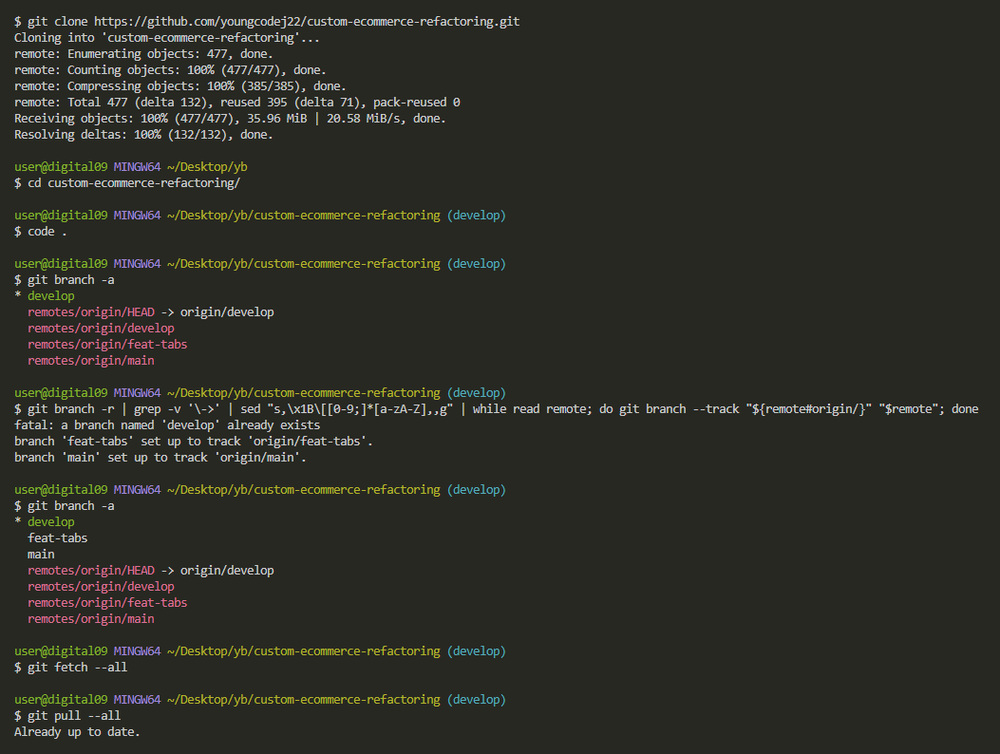

# E-commerce with Custom CSS Framework 연습 - 기록

## 진행 순서

### 환경설정

#### packages

1. vite
    - 비트는 자바스크립트 네이티브 모듈 (opens new window)을 기반으로 한 데브 서버
    - `yarn create vite`
2. aos
    - Animate On Scroll library
    - `yarn add aos`
3. node-sass
    - node 환경에서 사용가능한 sass
    - `yarn add node-sass`
4. swiper
    - carousel library
    - `yarn add swiper`
5. sass
    - css preprocessor
    - `yarn add -D sass`
6. @types/aos
    - vite를 통해 설치 한 것 외에 추가 설치

---

## 오류 해결

### 1. 이미 remote로 push한 commit message 변경

-   ❔ 문제: 마지막으로 push한 commit에 제목을 잘못 작성하여 수정이 필요했다. (convention에 맞게 ADD를 추가하였다.)
-   ❗ 해결
    -   `git commit --amend` 이후 마지막한으로 작성한 commit을 수정한다.
    -   `git push --force-with-lease origin main` (main이 아니라면 다른 브랜치를 작성)
-   ✔️ 생각한 점

    -   공식문서에서 보면 이 방법들을 추천하지 않는다. 이유는 협업을 한 경우에 동료들의 repository에 commit message가 업데이트 되지 않는다는 점이다. 만약 꼭 필요한 상황이라면 동료들에게 알려준 후에 해결 하는 것이 좋겠다.
    -   나의 경우는 혼자 작업을 하여서 일단 이 방법으로 수정을 하였다.

-   [github docs](https://docs.github.com/ko/pull-requests/committing-changes-to-your-project/creating-and-editing-commits/changing-a-commit-message)

<br />

### 2. tsx의 markup의 계층구조와 동일한 scss 가져오는 법

-   ❔ 문제: markup 계층구조와 동일한 scss 계층구조를 만들 수 있는 쉬운 방법이 있을까? (효율성을 위해)
-   ❗ 해결: extension설치, jsx to scss 사용
-   ✔️ 참고:
    -   [참고](https://inpa.tistory.com/entry/VS-Code-%E2%8F%B1%EF%B8%8F-HTML-CSS-%EB%8F%84%EA%B5%AC-%EC%B6%94%EC%B2%9C#html_css_support)
    -   [CSS를 SCSS로](https://css2sass.herokuapp.com/)

<br />

### 3. 데이터 binding을 위한 알맞은 JSON 생성

-   ❔ 문제: `ProductCard.tsx`에서 `labelImage`,`labeAlt`에 3개씩 데이터들이 있기 때문에 적절하게 `.map()`에 맞게 바인딩하기 어려웠다.

```json
// 기존 문제의 형식
{
    "labels": {
        "labelImage": [
            "https://mckayson.cdn-nhncommerce.com/data/icon/goods_icon/4.png",
            "https://mckayson.cdn-nhncommerce.com/data/icon/goods_icon/2.png",
            "https://mckayson.cdn-nhncommerce.com/data/icon/goods_icon/1.png"
        ],
        "labelAlt": ["신상품", "여성용", "두배적립"]
    }
}
```

```tsx
// Error 발생
<div className="item-icon-box">
    {product.labels.map((label, index) => (
        
    ))}
</div>
```

-   ❗ 해결: `labels`에서 한 요소에 묶어 넣으니 해결.

```json
{
    "labels": [
        [
            "https://mckayson.cdn-nhncommerce.com/data/icon/goods_icon/4.png",
            "여성용"
        ],
        [
            "https://mckayson.cdn-nhncommerce.com/data/icon/goods_icon/2.png",
            "두배적립"
        ],
        [
            "https://mckayson.cdn-nhncommerce.com/data/icon/goods_icon/1.png",
            "신상품"
        ]
    ]
}
```

```tsx
<div className="item-icon-box">
    {product.labels.map((label, index) => (
        
    ))}
</div>
```

-   ✔️ 참고: 적절한 데이터 디자인이 필요하다고 느꼈다.

<br />

### 4. git clone 시에 모든 branch들을 가져오는 방법

-   ❔ 문제: `git clone [repo url]`을 하면 `remotes/origin/HEAD`로 등록된 branch만 가져오게 된다. (나의 경우는 `main` branch에서 `develop` branch로 변경.)
-   ❗ 해결: `git clone [repo url]`을 먼저 한 후에, remote repository에서 추적하는 branch들을 모두 가져올 수 있는 명령어를 사용 후 `fetch --all`아 `pull --all`을 통해 해결.

```sh
git clone https://github.com/yourname/example.git
git branch -r | grep -v '\->' | sed "s,\x1B\[[0-9;]*[a-zA-Z],,g" | while read remote; do git branch --track "${remote#origin/}" "$remote"; done
git fetch --all
git pull --all
```

-   ✔️ 참고:
    -   
    -   [참고-1](https://stackoverflow.com/questions/10312521/how-do-i-fetch-all-git-branches)
    -   [참고-2](https://github.com/jobhope/TechnicalNote/blob/master/github/CloneRepository.md)

<br />

### 5. git rebase로 최근 commit이 아닌 원하는 commit 선택 후 변경하는 법

-   ❔ 문제: remote repository로 push를 했는데 commit message 오타로 인해 수정을 해야했다. (그러나 최근 commit이 아닌 최근에서 2번째 였다.)
-   ❗ 해결: `rebase`를 활용해서 변경할 수 있다.
    -   `rebase -i ${수정할 커밋의 직전 커밋}`: `-i`는 `--interative`
    -   이후 GUI 또는 vim형식으로 rebase editor가 열리고 rebase에 대한 명령어들을 활용하여 수정할 수 있다.
    -   `pick`(default), `drop`(삭제), `reword`(커밋 메시지 수정), `edit`(커밋 메세지, 설명 수정) 등...이 있다.
    -   이후 `git status` 입력 시 use`git commit --amend`(rebase후 최근 커밋 수정), use`git rebase --continue`(계속진행), use`git rebase --edit-todo`(수정)가 나오게 되는데, 상황에 맞게 사용하면 된다.
    -   이렇게 local repository는 모두 변경되었다. `git log`를 통해 원하는 커밋 상태인지 확인 후 remote repository를 `git push -f origin ${해당 branch}`로 변경해야 한다.
    -   `-f`(force)같은 경우는 혼자서 작업 시에는 문제가 없지만, 협업을 할 때는 내가 강제로 remote repository commit 상태를 변경하면 동료들의 local repository commit 상태와 달라질 수 있으니 유의하자.

```sh
// git rebase -i ${수정할 커밋의 직전커밋}
git rebase -i dafd898798279df
// 숫자는 보여지는 commit 개수
git rebase -i HEAD~3
git log
git status
git push -f origin ${수정할 remote branch}
```

-   ✔️ 참고:
    -   [rebase에 대한 설명](https://wonyong-jang.github.io/git/2021/02/05/Github-Rebase.html)

<br />

---

### Reference

-   [참고 site: mackayson-pc](https://www.mckayson.com/)
-   [참고 site: mackayson-mobile](https://m.mckayson.com/)
-   [좋은 commit message 작성법](https://djkeh.github.io/articles/How-to-write-a-git-commit-message-kor/)
